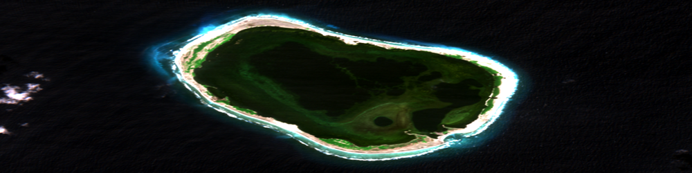
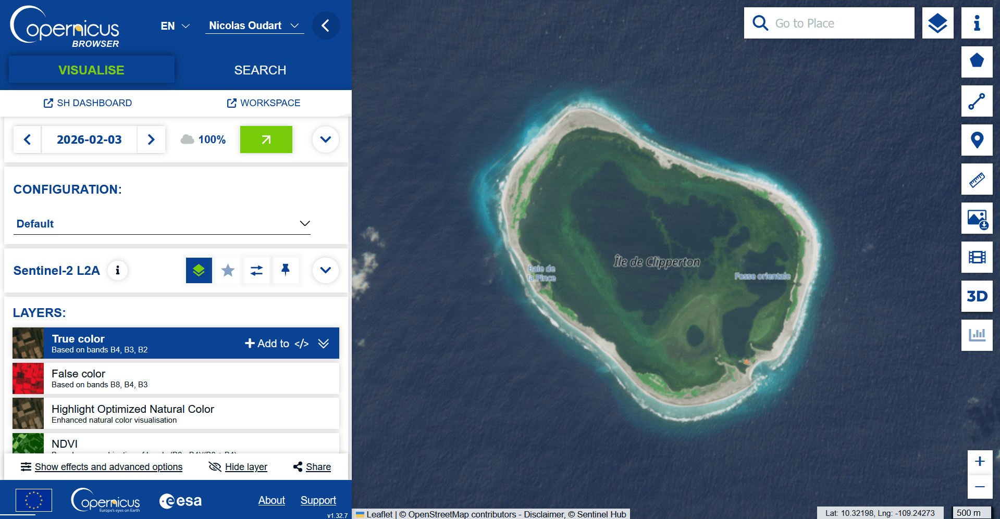

# A vous de jouer !

Pour conclure ce tutoriel, voyons comment **récupérer vous-même** des images satellite rasters à traiter avec **PyRaTe**.

---

Lors de vos projets, vous devrez **choisir** vous même les images satellites dont vous aurez besoin.

Pour faire ce choix, vous devrez vous poser les questions suivantes :

* Quel satellite ou constellation de satellites choisir ? (Les capteurs qu'il contient, les temps de revisite, la disponibilité des données pour les dates cherchées, etc.).

* Quelles bandes de fréquences choisir ? (Les bandes pertinentes pour détecter les surfaces que vous voulez étudier, avec la résolution dont vous avez besoin, etc.).

* Quelles régions et quelles dates choisir ? (La même saison ou des saisons différentes, la même région ou des régions différentes, etc.).

Pour trouver des images satellites "raster" de satellites **Sentinel** au format GeoTIFF, pour une sélection de bandes de fréquences, vous pouvez utiliser le moteur de recherche de **Copernicus** :

[Le browser de Copernicus](https://browser.dataspace.copernicus.eu)

Pour télécharger les GeoTIFF bruts des différentes bandes, vous devrez d'abord créer un compte.

Ensuite, il faut cliquer sur le bouton "Download image", et dans la fenêtre qui s'ouvre cliquer sur "Analytical".

Vous pouvez alors sélectionner le format, la résolution et les bandes de l'image à télécharger.
Par défaut, nous vous recommandons de télécharger :

* TIFF encodé sur 16 bits.

* Résolution "HIGH".

* Système de coordonnées WGS84.

* Les bandes dont vous avez besoin dans la catégorie "Raw".

Vous pouvez bien entendu choisir des images satellites de type "raster" provenant de n'importe quel satellite et les utiliser avec **PyRaTe**.