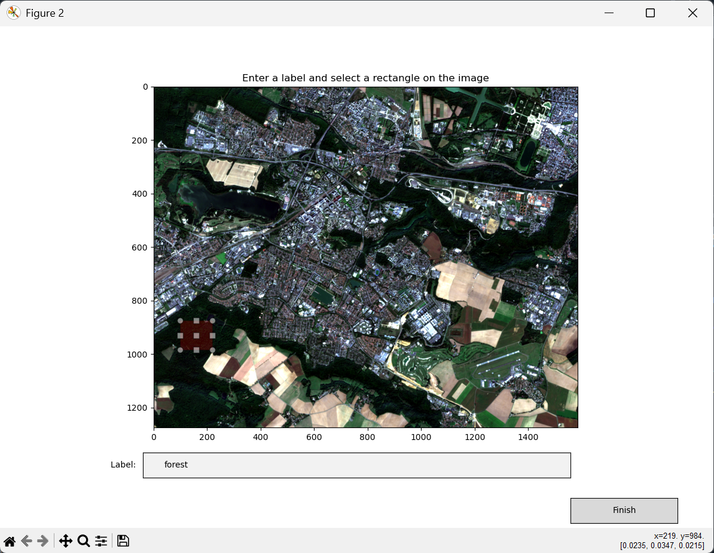
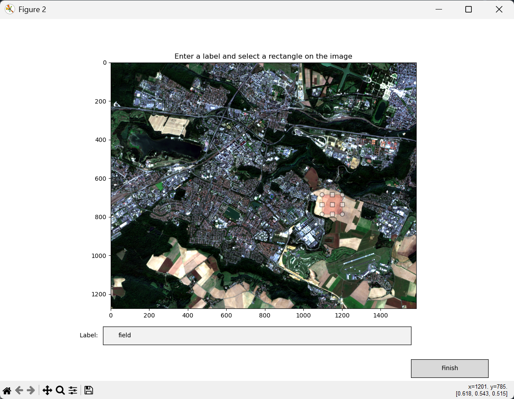
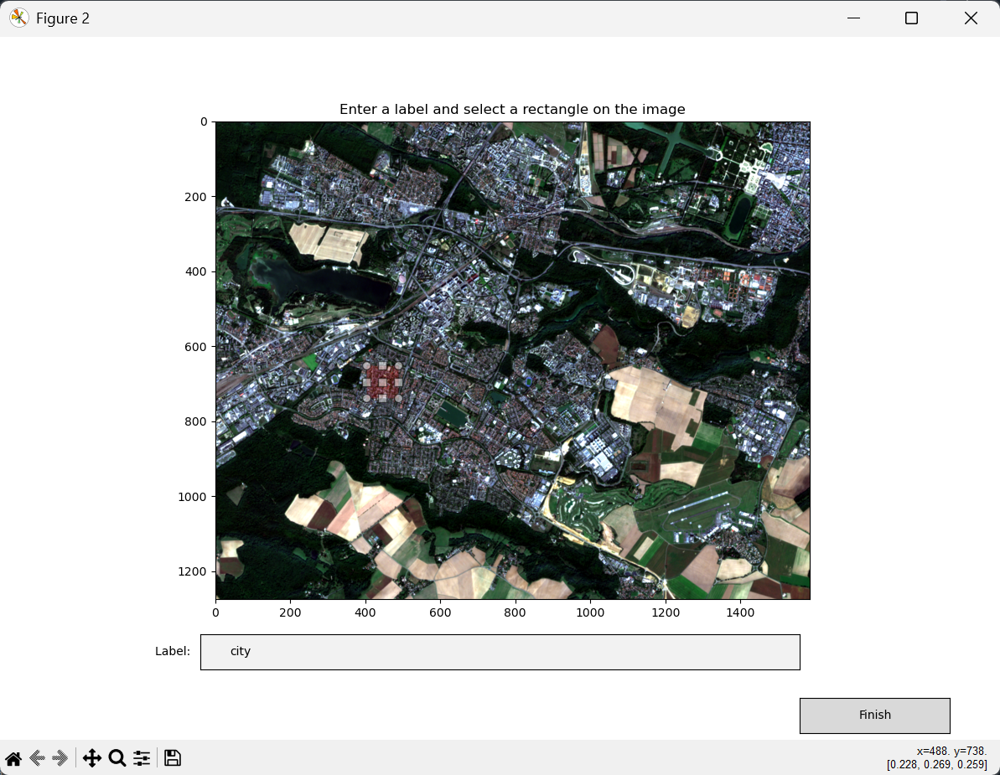

# Entrainement d'un classifieur

Maintenant que nous avons importé notre image "raster", nous allons utiliser **PyRaTe** pour entrainer un **classifieur** à prédire les labels associés aux pixels de l'image. 

---

## Principe de la classification supervisée

Ce que nous nous apprêtons à faire ici est de la "**classification supervisée**".

En "apprentissage automatique" (ou "Machine-Learning" en anglais), on essaye d'enseigner à un modèle comment renvoyer les sorties attendues à partir d'une sélection d'entrées.

Suivant la nature de la sortie, on parlera de :

* **Régression** si la sortie est quantitative et continue.

* **Classification** si la sortie est quantitative discrète ou qualitative.

Comme ici notre sortie est un "label" (ou "étiquette") que nous voulons attribuer à un pixel à partir des valeurs qu'il contient dans les différentes bandes, nous sommes clairement face à un problème de "**classification**".

L'expression "**supervisée**" vient du fait que pour enseigner à notre modèle comment prédire les labels corrects pour les pixels de l'image, nous allons lui fournir des exemples de pixels **déjà labélisés** pour qu'il puisse s'**entrainer**.

Au cours de l'entrainement, le modèle peut donc comparer ses prédictions aux labels attendus pour cet exemple, d'où le côté "supervisé".

Par opposition, ce que l'on appelle "classification non-supervisée" serait ici le fait de séparer les pixels en différents groupes suivant les valeurs qu'ils contiennent dans les différentes bandes, sans a priori sur l'identification du pixel.
On parle aussi de "clustering".

## Méthode de la décision Bayésienne

## Générer une base de données de test

## Etude statistique des données

## Entrainement

