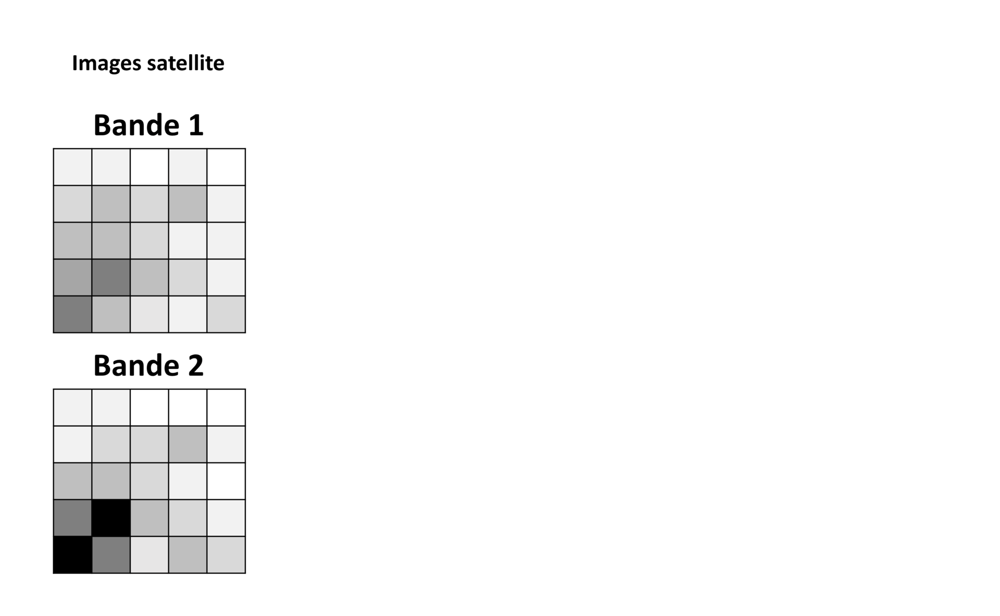

# Entrainement d'un classifieur

Maintenant que nous avons importé notre image "raster", nous allons utiliser **PyRaTe** pour entrainer un **classifieur** à prédire les labels associés aux pixels de l'image. 

---

## Principe de la classification supervisée

Ce que nous nous apprêtons à faire ici est de la "**classification supervisée**".

En "apprentissage automatique" (ou "Machine-Learning" en anglais), on essaye d'enseigner à un modèle comment renvoyer les sorties attendues à partir d'une sélection d'entrées.

Suivant la nature de la sortie, on parlera de :

* **Régression** si la sortie est quantitative et continue.

* **Classification** si la sortie est quantitative discrète ou qualitative.

Comme ici notre sortie est un "label" (ou "étiquette") que nous voulons attribuer à un pixel à partir des valeurs qu'il contient dans les différentes bandes, nous sommes clairement face à un problème de "**classification**".

L'expression "**supervisée**" vient du fait que pour enseigner à notre modèle comment prédire les labels corrects pour les pixels de l'image, nous allons lui fournir des exemples de pixels **déjà labélisés** pour qu'il puisse s'**entrainer**.

Au cours de l'entrainement, le modèle peut donc comparer ses prédictions aux labels attendus pour cet exemple, d'où le côté "supervisé".

Par opposition, ce que l'on appelle "classification non-supervisée" serait ici le fait de séparer les pixels en différents groupes suivant les valeurs qu'ils contiennent dans les différentes bandes, sans a priori sur l'identification du pixel.
On parle aussi de "clustering".

## Méthode de la décision Bayésienne

Une des méthodes de base pour la classification supervisée est la "**décision Bayésienne**" (ou "Naive Bayes" en anglais).

Le principe est le suivant : essayer d'estimer la probabilité conditionnelle d'un pixel d'avoir un label sachant les valeurs qu'il contient.
Le label ayant **la plus grande probabilité conditionnelle** est attribué à ce pixel.

Comme son nom l'indique, cette méthode va déterminer la probabilité conditionnelle de chaque classe en se basant sur la **formule de Bayes**.

Un **modèle Gaussien** est d'abord ajusté à la distribution des pixels au sein de chaque label dans les données d'entrainement grâce à l'algorithme du "maximum de vraisemblance" (ou "maximum likelihood" en anglais).
Ce modèle est ensuite utilisé dans la formule de Bayes pour calculer les probabilités conditionnelles de n'importe quel pixel pour chaque classe.

On peut tracer une **frontière de décision** entre les labels en traçant la ligne des valeurs de pixels pour lesquelles les probabilités conditionnelles entre 2 labels sont égales.

Voici une illustration de la méthode pour un exemple simple avec un "raster" à 2 bandes, et 2 labels possibles pour les pixels :

Pour plus d'informations sur la méthode, cliquez sur ce lien : [Cours sur la décision Bayésienne](https://nicoudart.github.io/UVSQ_LSSI633_data_science/Chap2_Classification_supervisee/#decision-bayesienne).

## Générer une base de données d'entrainement

Comme nous l'avons expliqué précédemment, la classification supervisée nécessite une phase d'**entrainement**, où nous enseignons au modèle comment prédire les bons labels à partir d'une base de données de pixels déjà labélisés.

Pour la décision Bayésienne, ceci correspond à la phase de détermination du modèle Gaussien de distribution des pixels au sein de chaque label.

Nous devons donc constituer une base de données de pixels, avec pour chacun un label associé.

Avec **PyRaTe**, vous devrez utiliser la commande suivante :

~~~bash
df_training = PyRaTe.labelling(band_list,display_rgb=[3,2,1])
~~~

(Le paramètre `display_rgb` vous permet de choisir les couleurs de l'affichage que vous désirez).

La fenêtre suivante s'ouvre alors :

Pour chaque label à ajouter à la base de données d'entrainement :

* Entrez le label dans la zone de texte en bas de la fenêtre.

* Sélectionnez avec le clic gauche de la souris des rectangles sur l'image correspondant à ce label.

Voici par exemple avec notre image Sentinel-2, la sélection des labels "forest", "field", "water" et "city" :

L'idée n'est pas de sélectionner tous les pixels de l'image correspondant à un label donné, mais d'être le plus **représentatif** possible de ce label.

Quand vous avez terminé, cliquez sur "Finish".

Un message s'affiche dans la console Python :

Il contient le nombre de pixels sélectionnés pour chaque label.

La variable `df_training` contient les données d'entrainement sous la forme d'un [DataFrame Pandas](https://pandas.pydata.org/docs/reference/api/pandas.DataFrame.html).

Il s'agit d'une sorte de tableau, contenant une colonne pour chaque bande de fréquence, et une colonne pour le label.
Chaque ligne correspond à un pixel sélectionné.

Nous utiliserons ce DataFrame pour entrainer notre modèle.

|Nota Bene|
|:-|
|Il est possible de sauvegarder votre base de données d'entrainement sous la forme d'un fichier CSV avec la méthode Pandas [to_csv](https://pandas.pydata.org/docs/reference/api/pandas.DataFrame.to_csv.html).|
|Ce CSV pourra être importé plus tard sous la forme d'un DataFrame Pandas avec la méthode [read_csv](https://pandas.pydata.org/docs/reference/api/pandas.read_csv.html).|
|Vous pouvez également créer des DataFrame Pandas de données d'entrainement pour différentes images, et les fusionner en une seule base par la suite, avec la méthode [concat](https://pandas.pydata.org/docs/reference/api/pandas.concat.html).|

**Ne négligez surtout pas l'étape de la constitution d'une base de données d'entrainement :** un classifieur entrainé sur des données de mauvaise qualité aura des performances mauvaises, _Garbage In, Garbage Out_.

Pour qu'un modèle soit performant, il lui faut des données de **qualité** (correctement labélisées, représentatives) et **en quantité** (plusieurs milliers de pixels si possible).

Dans l'idéal, il faut que les données d'entrainement soient le plus représentatives possibles des cas d'application de vos projets, en provenant potentiellement de plusieurs images différentes.

## Etude statistique des données

Avant d'entrainer un classifieur, il est important de vérifier la **séparabilité** des différents labels suivants les valeurs dans les différentes bandes du "raster".

Et avant d'entrainer un classifieur de type "décision Bayésienne", il est important de vérifier si l'**hypothèse Gaussienne** des distributions a du sens.

C'est pourquoi on veut en général afficher des **histogrammes** de la répartition des valeurs des pixels de notre base d'entrainement pour les différents labels et pour les différentes bandes.

Ceci est possible avec **PyRaTe**, en utilisant la commande :

~~~bash
PyRaTe.dataset_statistics(df_training)
~~~

On obtient alors les 10 histogrammes suivants (un par bande) :

_Certaines bandes du "raster" ont-elles l'air plus pertinentes que d'autres pour séparer nos différents labels ?_

_L'hypothèse Gaussienne des distributions a-t-elle l'air raisonnable ?_

Dans le cadre de vos projets, il faudra vous poser ces questions.

|Nota Bene|
|:-|
|Si elle n'apporte pas grand chose, une bande peut être retirée du DataFrame avec la méthode Pandas [drop](https://pandas.pydata.org/docs/reference/api/pandas.DataFrame.drop.html).|
|Il faut néanmoins avoir en tête qu'une seule bande est rarement suffisante pour séparer 2 labels : il faut souvent utiliser la combinaison de plusieurs bandes.|

## Entrainement

Maintenant que nous avons vérifié la qualité de notre base de données d'entrainement, nous allons pouvoir l'utiliser pour **entrainer** notre modèle.

Voici la commande pour obtenir la "pipeline" de notre modèle à partir des données d'entrainement (l'apprentissage peut prendre un peu de temps) :

~~~bash
classifier_pipeline = PyRaTe.training(df_training)
~~~

On parle ici de "pipeline" car il n'y a en réalité pas que le classifieur.
Les valeurs de pixels pour les différentes bandes subissent une mise à l'échelle avant passage dans le classifieur.

Un message apparait dans la console Python :

Il s'agit de l'**exactitude** ("accuracy" en anglais) de notre modèle sur les données d'entrainement.

|Exactitude|
|:-|
|L'exactitude est un critère de performance classique pour un classifieur.|
|Elle correspond au ratio entre le nombre prédictions correctes et le nombre total de prédictions.|
|Ce critère résume bien les performances d'un classifieur tant que les labels ne sont pas trop déséquilibrés au sein de la base de données.|

Ce critère donne par définition des valeurs entre 0 et 1.
Plus il est proche de 1, meilleur est le classifieur sur ces données.

_L'entrainement s'est-il bien passé ici ?_

_Pensez-vous qu'une exactitude élevée sur les données d'entrainement est suffisante pour juger des performances du classifieur de manière générale ?_