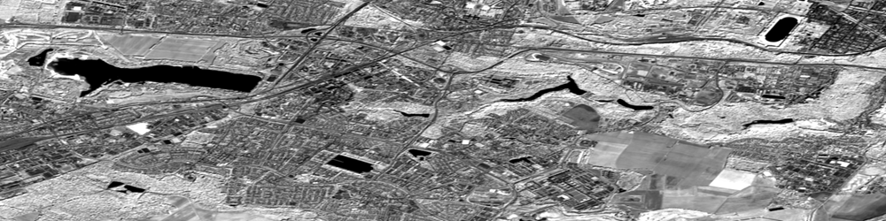
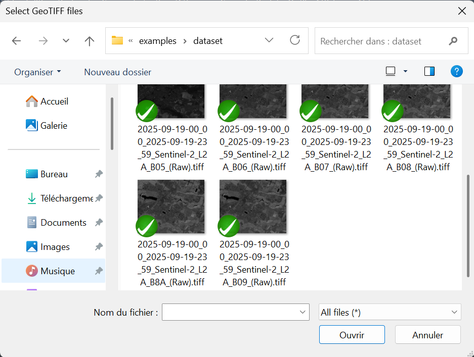
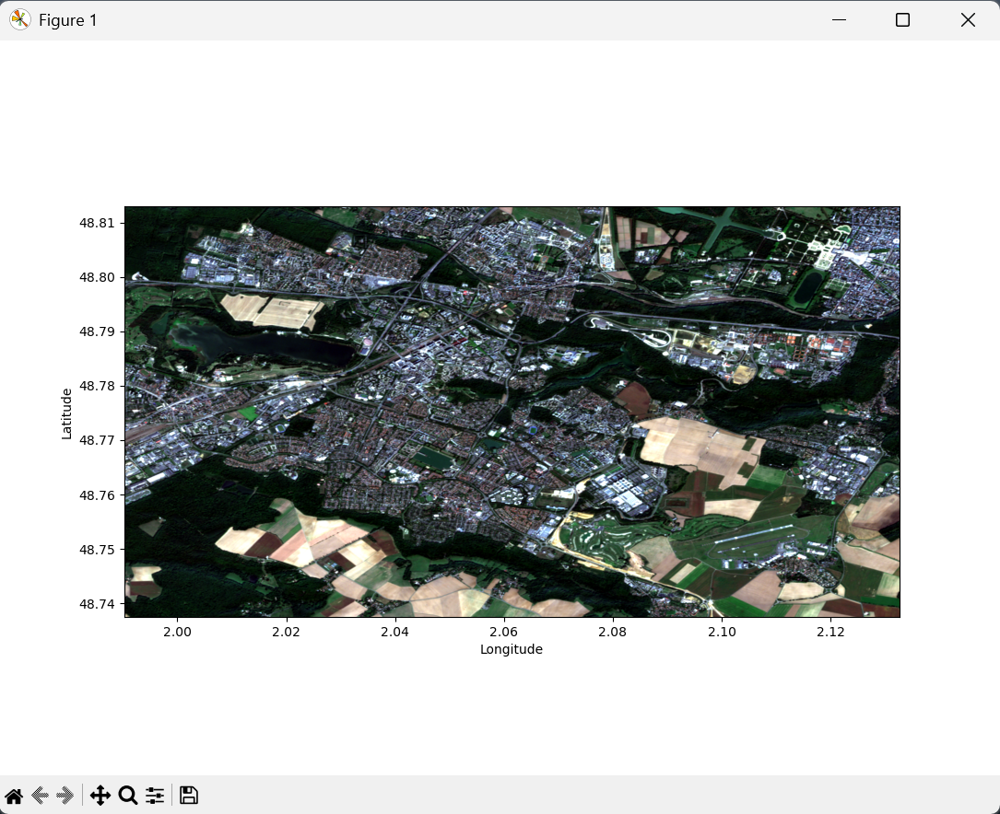
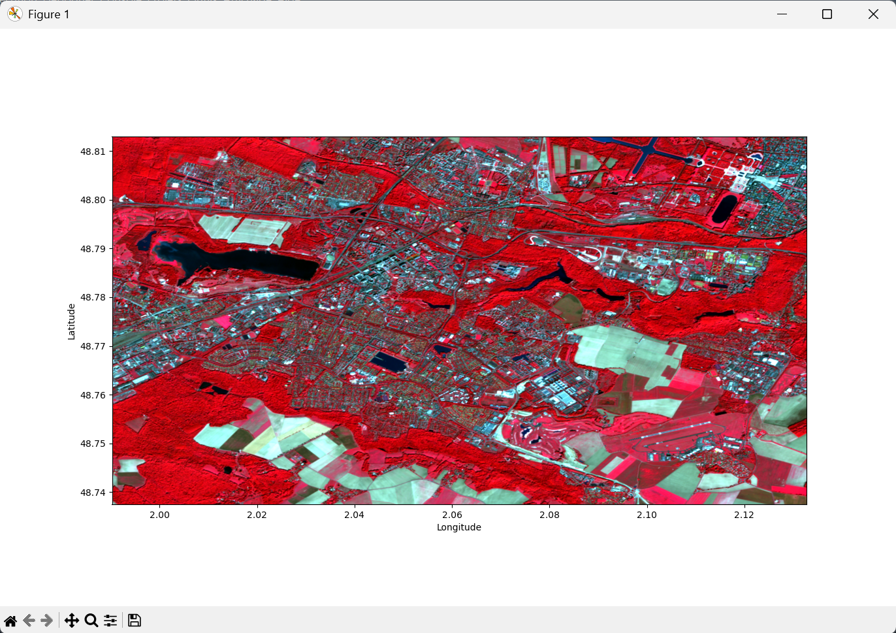
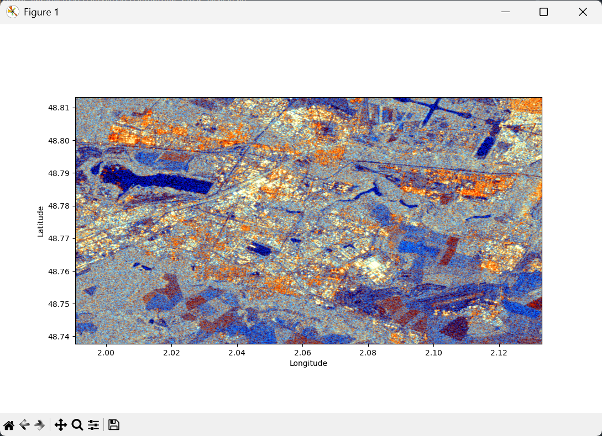

# Importation d'une image raster

Pour commencer, nous allons utiliser **PyRaTe** pour **importer** une image satellite multi-bande à partir de fichiers **GeoTIFF**, puis réaliser un **affichage géoréférencé** à partir de ces données.

---

## Raster et télédétection

Le "Ra" de **PyRaTe** est pour "**Raster**", et le "Te" est pour "**Télédétection**".

Si vous êtes maintenant familiers avec la notion de "télédétection", il est probable que vous n'ayez jamais entendu parler de "raster".

Il existe 2 grands types d'images : les images **matricielles** ou "raster", et les images **vectorielles**.

Comme leurs noms l'indiquent, l'une est définie par une ou plusieurs matrices 2D, l'autre par des vecteurs.

|Raster|
|:-|
|Image constituée d'une (ou plusieurs) matrice 2D.|
|Chaque élément dans la matrice correspond à un pixel à afficher.|
|Les valeurs stockées à une position dans les matrices 2D correspondent à l'intensité des pixels dans différentes couleurs.|

Lors de vos projets de télédétection, vous manipulerez exclusivement des images "raster".

## Importation de fichiers GeoTIFF

Vous trouverez dans le dossier "examples/dataset_img" de **PyRaTe** un jeu de 10 fichiers GeoTIFF.

|GeoTIFF|
|:-|
|Le TIFF est un format d'image "raster" propriétaire, mais assez flexible, couramment utilisé en télédétection.|
|En effet, il permet d'enregistrer des métadonnées avec l'image, notamment les informations de géoréférencement.|
|Dans ce cas, on appelle le fichier un "GeoTIFF".|

Il s'agit d'une seule image satellite "raster" de Saint-Quentin-en-Yvelines, acquise dans 10 bandes optiques différentes le 19/09/2025 par Sentinel-2.

Voici à quoi correspondent ces bandes d'acquisition de Sentinel-2 :

|Bande|Cible                   |Longueur d'onde|Résolution au sol|
|:---:|:----------------------:|:-------------:|:---------------:|
|B01  |Aérosols                |443 nm         |60 m             |
|B02  |Bleu                    |490 nm         |10 m             |
|B03  |Vert                    |560 nm         |10 m             |
|B04  |Rouge                   |665 nm         |10 m             |
|B05  |Red-edge                |705 nm         |20 m             |
|B06  |Red-edge                |740 nm         |20 m             |
|B07  |Red-edge                |783 nm         |20 m             |
|B08  |Proche infrarouge       |842 nm         |10 m             |
|B08A |Proche infrarouge étroit|865 nm         |20 m             | 
|B09  |Vapeur d'eau            |945 nm         |60 m             |

Pour importer ces différents fichiers GeoTIFF avec **PyRaTe**, utilisez la commande suivante :

~~~bash
band_list,band_bounds = PyRaTe.importation()
~~~

Apparait alors la fenêtre suivante :

Cherchez les fichiers GeoTIFF dans vos dossiers, sélectionnez-les et cliquez sur "Ouvrir".

La variable `band_list` contiendra alors une liste de matrices Numpy, chacune correspondant à une bande.

La variable `band_bounds` contient les limites géographiques de l'image.

Si les limites géographiques des différents "raster" importés ne sont pas les mêmes, un message d'erreur apparaitra.

|Nota Bene|
|:-|
|Ici, chaque bande était enregistrée dans un GeoTIFF différent.|
|La fonction gère aussi les GeoTIFF contenant plusieurs bandes à la fois.|

## Affichages RGB

Pour vérifier le contenu de nos GeoTIFF, on peut vouloir afficher une image en couleurs (RGB), géoréférencée, à partir des différentes bandes importées.

Le plus classique est de faire un affichage en "**vraies couleurs**" : la bande du "rouge" (B04) en rouge, la bande du "vert" (B03) en vert, et la bande du "bleu" (B02) en bleu.

Pour réaliser un tel affichage, utilisez la commande suivante :

~~~bash
PyRaTe.img_display(band_list,band_bounds,display_rgb=[3,2,1])
~~~

Le paramètre `display_rgb` vous permet de sélectionner dans `band_list` l'indice des matrices à utiliser pour le rouge, le vert et le bleu.
On sélectionne ici B04, B03 et B02 avec les indices 3, 2 et 1.

Voici la figure qui s'affiche :

Bien que les longueurs d'ondes perçues par le satellite dans ces 3 bandes ne correspondent pas exactement aux pics de sensibilité des "cônes" de la rétine humaine, cet affichage donne un ressenti "naturel" des couleurs.

En imagerie satellite, il est également classique de réaliser un affichage en "**fausses couleurs**" de la manière suivante : la bande du "proche infrarouge" (B08) en rouge, la bande du "rouge" (B04) en vert, et la bande du "vert" (B03) en bleu.

Pour réaliser un tel affichage, il suffit de reprendre la commande précédente, en modifiant le paramètre `display_rgb` :

~~~bash
PyRaTe.img_display(band_list,band_bounds,display_rgb=[7,3,2])
~~~

Voici la figure qui s'affiche :

Ce type d'affichage en "fausses couleurs" est particulièrement utile pour l'étude de la végétation : la chloropylle réfléchit fortement le proche infrarouge, ce qui permet de la faire ressortir en rouge dans l'image.
Les contrastes entre zones urbaines, plans d'eaux et végétation sont également renforcés.

_Est-ce bien ce que vous observez ?_

Suivant l'application, on peut imaginer réaliser des affichages en "fausses couleurs" avec d'autres bandes d'intérêt.

## Imagerie optique et radar

Les 10 bandes de l'image que vous avez importée correspondent à 10 canaux d'acquisition dans le domaine **optique**.
Comme nous l'avons vu, chaque canal est centré sur **une longueur d'onde** de la lumière (visible, infrarouge ou ultraviolette).
Il s'agit d'imagerie "**passive**", puisque c'est la lumière du soleil qui éclaire la surface observée.

**C'est cette image optique que nous utiliserons dans la suite de ce tutoriel**.

Cependant, **PyRaTe** permet aussi d'importer, d'afficher puis d'analyser des images **radar**.

Contrairement à l'imagerie optique, l'imagerie radar se fait généralement dans le domaine des **micro-ondes**.
L'imagerie radar est "**active**", puisque nous éclairons la surface observée avec un signal micro-ondes émit par le satellite.
L'imagerie optique de la surface ne peut se faire que de jour, et quand la couverture nuageuse est faible, alors que l'imagerie radar peut se faire **de jour comme de nuit**, et est capable de "**percer les nuages**".

|Nota Bene|
|:-|
|Pour faire une analogie avec les 5 sens, on compare souvent l'imagerie optique à **la vue**, et l'imagerie radar au **toucher**.|
|En effet, l'imagerie optique nous donnera plutôt une information sur la "couleur" de la surface observée, alors que l'imagerie radar donnera une information sur sa "rugosité".|
|Ceci est lié au fait que le radar est un instrument actif, qui fonctionne à des longueurs d'ondes centimétriques, plus proches de la dimension des structures que l'on veut observer à la surface.|

Vous trouverez dans le dossier "examples/dataset_radar" de **PyRaTe** un jeu de 2 fichiers GeoTIFF correspondant à une image radar "raster" de Saint-Quentin-en-Yvelines, acquise par Sentinel-1.

Le radar de Sentinel-1 est un SAR ou "**radar à synthèse d'ouverture**".
Il s'agit d'une méthode de traitement de données pour obtenir des images radars ayant une grande résolution au sol, tout en gardant une taille d'antenne acceptable pour un satellite.

Ce radar fonctionne dans la **bande de fréquences C** (5.4 GHz, soit environ 6 cm de longueur d'onde), a une résolution au sol pouvant descendre jusqu'à 5 m, et est capable d'émettre et recevoir dans **2 polarisations** : horizontale (H) et verticale (V).

On parlera de "**co-polar**" quand on émet et reçoit dans la même polarisation (HH ou VV), et de "**cross-polar**" lorsque l'on émet et reçoit dans des polarisations différentes (HV ou VH).
La combinaison des informations de co-polar et cross-polar est particulièrement intéressante pour **discriminer certains types de surface**.

Les 2 GeoTIFF à votre disposition correspondent à la bande co-polar VV, et la bande cross-polar VH.

Comme pour l'image optique, vous pouvez charger ces 2 bandes de l'image radar avec la fonction `importation` de **PyRaTe**.

Une fois l'image radar importée, il est classique de faire un affichage RGB "fausses couleurs" avec la cross-polar pour le rouge, la co-polar pour le vert, et le ratio co-polar / cross-polar pour le bleu.
Ceci est rendu possible dans **PyRaTe** avec la commande suivante :

~~~
PyRaTe.radar_display(band_list,band_bounds,co_polar=0,cross_polar=1)
~~~

Le paramètre `co_polar` vous permet de sélectionner dans `band_list` l'indice de la matrice à utiliser comme co-polar, et `cross-polar` l'indice de la matrice à utiliser comme cross-polar.
On considère ici que le 1er GeoTIFF importé est le VV, et le second le VH.

Voici la figure qui s'affiche :

On interprète ce type d'affichage RGB de la manière suivante :

* Le **rouge** correspond à des surface "dépolarisant" beaucoup le signal radar. Il s'agit donc probablement de zones **fortement rugueuses**, provocant de la diffusion de volume.

* Le **vert** correspond à des surfaces "dépolarisant" peu le signal radar. Il s'agit donc de surfaces **plutôt lisses**, provocant une réflexion quasi-directe, avec un peu de diffusion de surface.

* Le **bleu** permet de faire ressortir des surface **lisses**, ou des "**doubles rebonds**".

* Le **jaune** correspond à des **surfaces complexes**, renvoyant autant de signal "dépolarisé" que "polarisé".

* Une surface **sombre** sera **extrêmement lisse** : on a une réflexion quasi-spéculaire.

|Nota Bene|
|:-|
|On parle ici de "rugueux" ou "lisse" du point de vue du radar, c'est-à-dire **de sa longueur d'onde**.|
|Suivant la longueur d'onde du radar utilisé, une même surface paraitra donc plus ou moins rugueuse.|

_A partir de ces informations, comment interprétez-vous la rugosité des surfaces à Saint-Quentin-en-Yvelines ?_