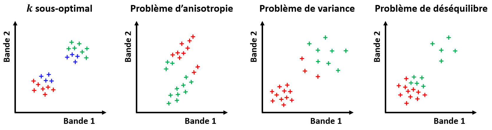
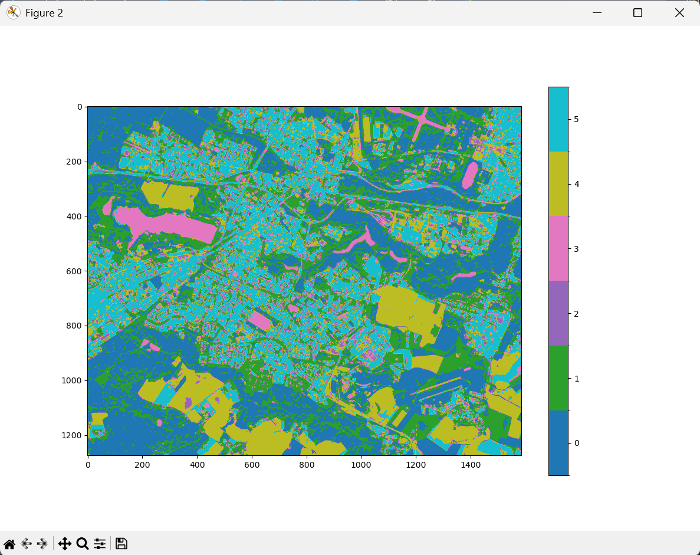
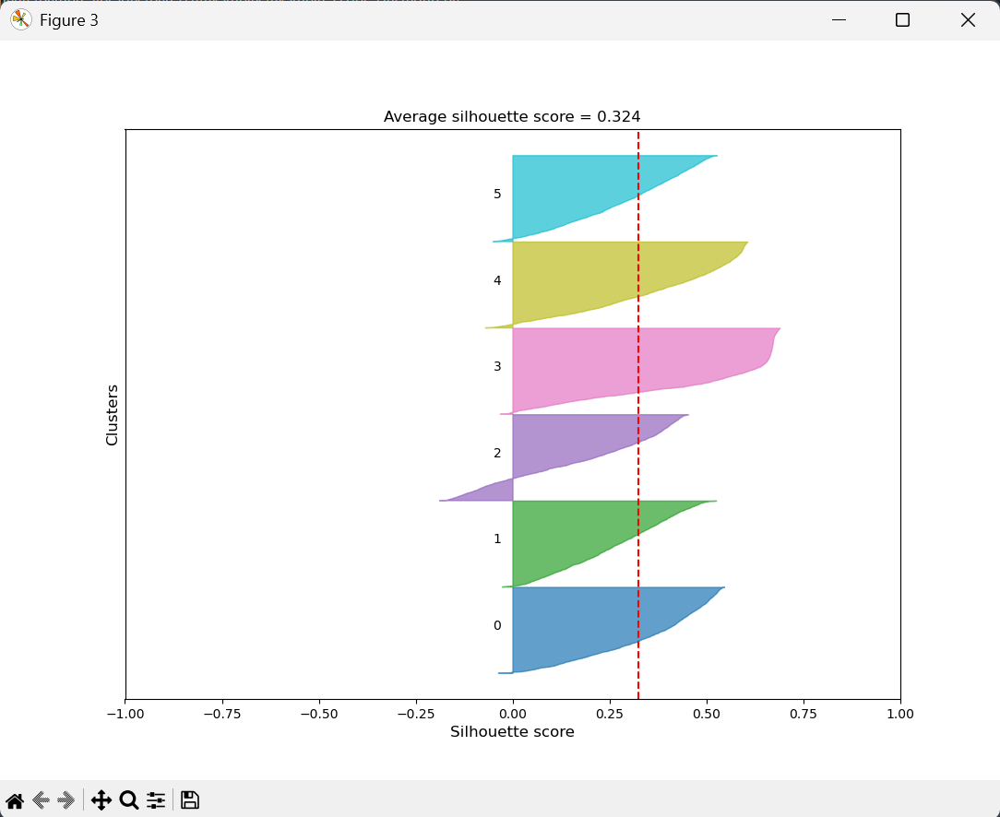
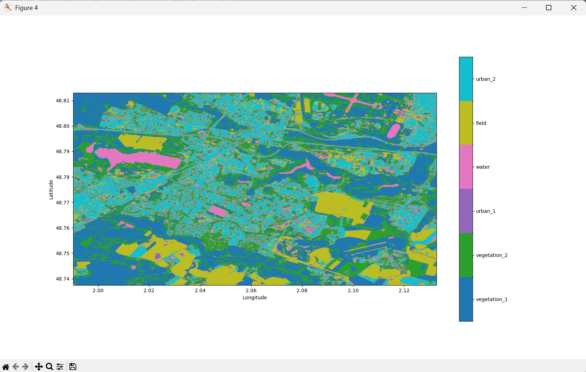

# Partitionnement d'une image raster

Dans le cas où nous n'avons aucune idée de l'identification des pixels de notre image satellite, nous pouvons toujours essayer de les grouper par similarité.
Un tel **partionnement** est également possible avec **PyRaTe**.

---

## Principe de la classification non-supervisée

Comme nous l'avions expliqué plus tôt, le principe de la classification non-supervisée, ou "**partitionnement**" ("clustering" en anglais), est de **grouper** les pixels de notre image par **similarité** de leurs valeurs dans les différentes bandes.
Une fois les groupes formés, nous pourrons essayer de les comprendre pour les **labéliser**.

Un **bon partitionnement** des pixels a les 2 caractéristiques suivantes :

* Les individus au sein d'un groupe sont **les plus similaires possible**.

* Les différents groupes sont **les plus différents possible**.

Pour mesurer des "similarités" entre pixels ou groupes de pixels, on évalue des **distances** dans l'espace formé par les différentes bandes de l'image.

En général, **le nombre de groupes** de pixels à former est une **entrée** des méthodes de partitionnement.
Nous discuterons dans la suite du choix de ce paramètre, qui est loin d'être trivial.

## Méthode des K-moyennes

La méthode la plus classique en partitionnement est celle des **K-moyennes** (ou "K-means" en anglais).

Il s'agit d'une méthode **itérative**, qui pour un nombre de groupes K demandé par l'utilisateur cherche à **minimiser les distances entre individus au sein de chaque groupe**.

On initialise aléatoirement K points dans l'espace des bandes de l'image, un pour chaque groupe que nous voulons former.

Jusqu'à ce qu'un critère d'arrêt soit atteint, on itère les opérations suivantes :

* On assigne à chaque pixel le groupe du point le plus proche.

* On calcule la moyenne de chacun des groupes ainsi formés.

* On déplace chaque point à la position de la moyenne de son groupe.

Les K points vont ainsi converger vers la moyenne des groupes minimisant les distances intra-groupe.

Voici une illustration de la méthode pour un exemple simple avec un "raster" à 2 bandes, et K = 3 :

**Attention !** Lorsque l'on partitionne avec les K-moyennes, on fait des **hypothèses implicites** sur les groupes à former.
Si ces hypothèses ne sont pas respectées, le partitionnement renvoyé par la méthode ne sera pas optimal.

Voici quelques cas problématiques classiques pour les K-moyennes :

Pour plus d'informations sur la méthode, cliquez sur ce lien : [Cours sur les K-moyennes](https://nicoudart.github.io/UVSQ_LSSI633_data_science/Chap4_Partitionnement/#k-moyennes).

## Partitionnement

Mettons que nous avons importé les différentes bandes de notre image de Saint-Quentin-en-Yvelines avec **PyRaTe**, et que nous voulons à présent partitionner les pixels de cette image.

Pour séparer les pixels en un nombre de groupes K = 6, utilisez la commande suivante (le partitionnement peut prendre un peu de temps) :

~~~bash
img_label = PyRaTe.clustering(band_list,6,1)
~~~

Le 3ème paramètre est un entier correspondant à la "graine" utilisée pour l'initialisation aléatoire des K points dans la méthode des K-moyennes.

En effet, cette initialisation étant aléatoire, 2 appels de la méthode sur les mêmes données, avec le même K, ne donneront pas exactement le même résultat.
Pour s'assurer que les résultats soient reproductibles, on peut "forcer" l'initialisation aléatoire avec ce paramètre.
Ici on a choisi 1.

2 figures apparaissent à l'écran.
La 1ère est le résultat du partitionnement de notre image, avec les différents groupes indiqués par des couleurs différentes : 

A ce niveau, les groupes ne sont pas labélisés : un numéro leur a été attribué aléatoirement.

La 2nde figure est un indicateur de qualité de notre partition appelé "coefficient de silhouette".
Nous en parlerons plus en détails dans la section suivante.

La variable `img_label` retournée par la fonction est une matrice Numpy contenant des nombres entiers, correspondant aux différents groupes formés.
Elle nous servira pour l'affichage géoréférencé de notre résultat une fois celui-ci labélisé.

## Choix du nombre de classes

Comme nous l'avons mentionné précédemment, le **nombre de groupes** à former K est une **entrée** de la méthode des K-moyennes.

Il est délicat de choisir un nombre de groupes lorsque l'on a aucun a priori sur l'identification de nos pixels.
Et c'est une problématique commune à tous les problèmes de partitionnement.

Instinctivement, on voudrait chercher la valeur de K qui minimise les distances intra-groupe.
Problème : les distances intra-groupe diminuent toujours à mesure que l'on augmente K.

Il existe d'autres critères que l'on peut utiliser pour essayer d'optimiser K.
Le plus connu est le "**coefficient de silhouette**".

Pour chaque pixel d'une image, on peut déterminer un coefficient de silhouette, indiquant **la qualité de l'attribution du pixel à son groupe**.
Il est un compromis entre un indicateur de **similarité intra-classe** et un indicateur de **séparabilité inter-classe**.

Voici une illustration pour une image à 2 bandes, et K = 3 :

Ce score varie entre -1 et 1, et on l'interprète de la manière suivante :

* Plus le score est proche de 1, et plus l'individu est bien attribué à son groupe.

* Plus le score est proche de -1, et moins l'individu est bien attribué à son groupe.

* Un score de 0 indique que l'individu est entre 2 groupes.

On peut calculer un coefficient de silhouette **moyen** pour une partition afin d'en juger la qualité.
Une bonne approche est de démarrer à K = 2, de tester des valeurs de K croissantes, et de choisir la partition donnant le meilleur score moyen, ou les meilleurs scores pour les différents groupes.

C'est ce que représente la 2nde figure apparue sur votre écran :

Pour chaque groupe, on a échantillonné 2000 pixels, et on a calculé leur coefficient de silhouette.
La distribution de ces coefficients est affichée sous la forme d'histogrammes.
Le coefficient de silhouette moyen est affiché par un trait en pointillé rouge.

Pour nos applications, on aura classiquement un score moyen entre 0.2 et 0.4.
Un score au-dessus de 0.5 sera considéré comme exceptionnellement bon.

Sur la figure affichée ici, on voit que le groupe 3 est clairement de bonne qualité, avec peu de pixels mal attribués (scores négatifs) et beaucoup de pixels très bien attribués (scores supérieurs à 0.5).
A l'inverse, le groupe 2 a l'air d'être le plus mal définit, avec beaucoup de pixels mal attribués.

Le score moyen est de 0.324, ce qui est relativement bon pour notre application.

_Essayez plusieurs valeurs de K entre 2 et 10. Comment jugez-vous la qualité des différentes partitions obtenues ? Laquelle choisiriez-vous ?_

|Nota Bene|
|:-|
|Si nous ne calculons le coefficient de silhouette que pour 2000 pixels par groupe, c'est que le calcul de ce score est trop long en pratique pour des millions de pixels.|
|Les scores obtenus ne sont donc que des **approximations** des coefficients de silhouette réels de notre partition.|
|Pour la reproductibilité des résultats, la même graine aléatoire que pour l'initialisation des K-moyennes est utilisée pour l'échantillonnage.|

## Affichage des labels

Reprenons notre partition en 6 groupes de l'exemple d'image de Saint-Quentin-en-Yvelines.

Dans l'idéal, nous voudrions pouvoir attribuer un label à chacune des 6 classes obtenues : en Machine-Learning, on appelle cette étape "**labélisation**".
La tâche est loin d'être triviale.

Pour ce faire, on peut se baser sur :

* Un analyse visuelle de l'image dans les différentes bandes, avec des affichages RGB.

* Des histogrammes des valeurs des pixels des différents groupes, pour différentes bandes de l'image.

* La documentation de l'instrument du satellite d'où provient l'image.

* Une étude bibliographique sur les observations du site d'étude.

* Les cartes géographiques du site d'étude.

Une fois des labels décidés pour les différents groupes de pixels, vous pouvez en faire une liste avec une commande du type :

~~~bash
labels_code = ['vegetation_1','vegetation_2','urban_1','water','field','urban_2']
~~~

Et avec cette liste de labels, réaliser un affichage géoréférencé de la même manière que pour la classification supervisée, en utilisant la commande :

~~~bash
PyRaTe.label_display(img_label,band_bounds,labels_code)
~~~

On obtient alors la figure suivante :

_Les labels choisis vous paraissent-ils pertinents ? Pouvez-vous en proposer de meilleurs en vous basant sur l'image RGB en vraies et en fausses couleurs?_