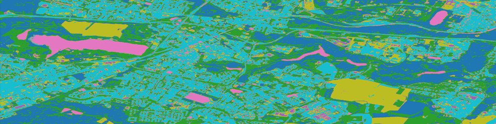
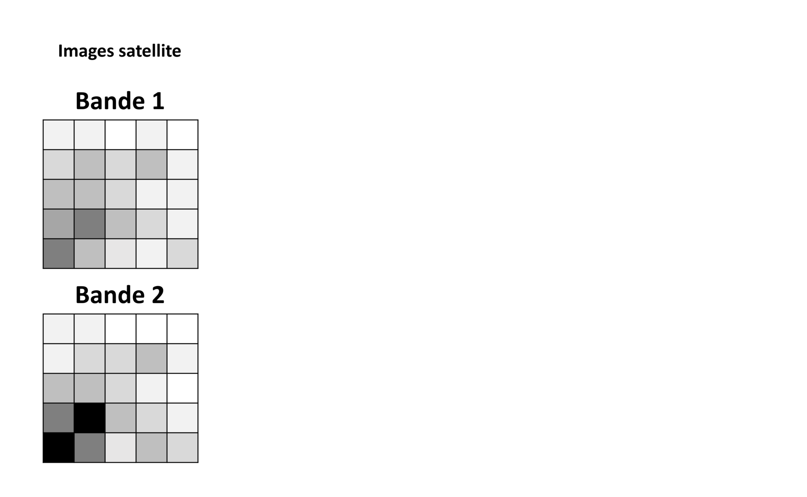
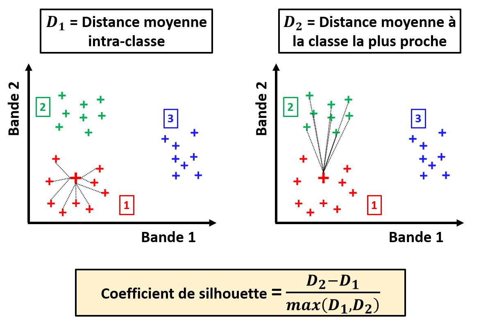

# Partitionnement d'une image raster

Dans le cas où nous n'avons aucune idée de l'identification correspondant aux pixels de notre image satellite, 

---

## Principe de la classification non-supervisée

## Méthode des K-moyennes

## Choix du nombre de classes

## Affichage des labels