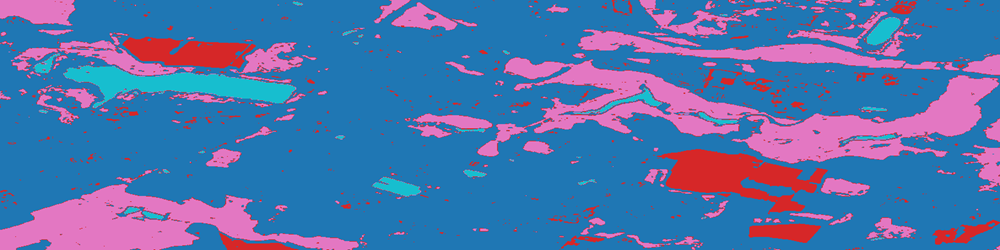
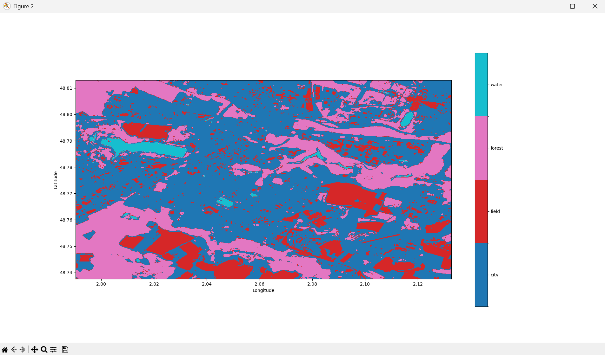

# Prédiction de labels

Maintenant que nous avons validé les performances de notre classifieur en généralisation, nous pouvons l'utiliser avec confiance pour prédire les labels de tous les pixels de notre image "raster".
**PyRaTe** permet à la fois la **prédiction** et l'affichage des labels prédits.

---

## Prédire avec un classifieur

Avec **PyRaTe**, pour **prédire** les labels des pixels avec le classifieur que vous avez entrainé, utilisez la commande suivante :

~~~bash
img_label,labels_code = PyRaTe.prediction(classifier_pipeline,band_list)
~~~

Il y a 2 variables de sortie : 

* `img_label` est une matrice Numpy contenant des nombres entiers, correspondant aux différents labels.

* `labels_code` est une matrice Numpy contenant les différents labels dans l'ordre des nombres entiers de `img_label`.

Ces 2 sorties, associées aux données de géoréférencement du "raster" permettent d'afficher les prédictions pour notre image.

Vous pouvez également appliquer cette fonction à de nouvelles images à classifier.

## Affichage des labels

Avec **PyRaTe**, pour afficher les **labels** prédits pour une image, avec le géoréférencement, utilisez la commande suivante :

~~~bash
PyRaTe.label_display(img_label,band_bounds,labels_code)
~~~

Voici la figure qui s'affiche alors :

Les différentes couleurs permettent d'identifier les 4 labels ("forest", "field", "water" et "city").

**Nous avons obtenu le résultat attendu !**

|Nota Bene|
|:-|
|Si dans le cadre de vos projets de télédétection, vous voulez déterminer le nombre de pixels assignés à un label pour un calcul de surface, c'est possible.|
|Il suffit avec Numpy de calculer le nombre d'éléments dans la matrice `img_label` égaux à l'entier correspondant au label à dénombrer.|

Dans notre exemple, nous avons labélisé des pixels en se basant sur notre **connaissance du terrain**.

_Comment faire dans les cas où nous n'avons aucune connaissance du terrain ?_